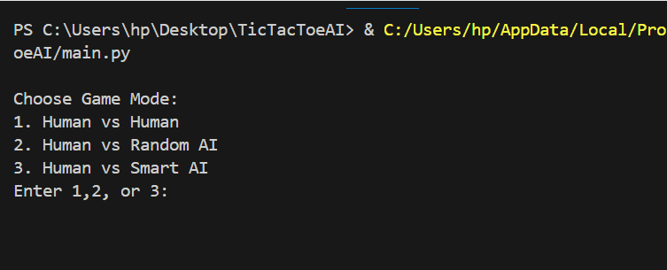

# TicTacToe (AI Edition)

A terminal-based 2-player Tic Tac Toe game in Python with modular AI opponents. Choose to play against a human, a random-move AI, or a smart AI powered by the Minimax algorithm.

---

## 🎮 Features

- ✅ Human vs Human mode  
- 🤖 Human vs AI (Random or Smart AI using Minimax)   
- 🧩 Player symbol selection (X or O)  
- ✅ Win detection for rows, columns, and diagonals  
- ✅ Draw detection when the board is full  
- ✅ Input validation for valid moves  
- 🧠 Smart AI calculates optimal move using Minimax  
- 🎯 Clean modular code split across files  

---

## 📁 Project Structure
```
TicTacToeAI/
│
├── game.py # Core game logic (board, player moves, win/draw check)
├── randomAI.py # Random AI player logic
├── smartAI.py # Smart AI logic using Minimax algorithm
└── main.py # Game launcher to choose mode 
```

## 🔧 How to run
Run this command in your terminal:
```
python main.py
```
## 🖼️ Demo



## 👩‍💻 Author

**Laiba Khalid**  
GitHub: [https://github.com/Laibakhalid23](https://github.com/Laibakhalid23)
