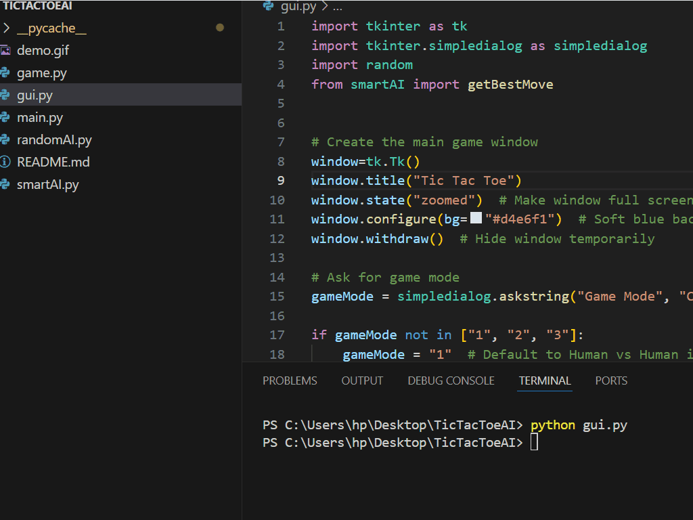

# TicTacToe (AI Edition + GUI)

A terminal-based 2-player Tic Tac Toe game in Python with modular AI opponents. Choose to play against a human, a random-move AI, or a smart AI powered by the Minimax algorithm — now also playable with a friendly GUI using Tkinter!

---

## 🎮 Features

### 🖥️ Terminal Mode:
- ✅ Human vs Human mode 
- 🤖 Human vs AI (Random or Smart AI using Minimax)   
- 🧩 Player symbol selection (X or O) in terminal mode 
- ✅ Win detection for rows, columns, and diagonals  
- ✅ Draw detection when the board is full  
- ✅ Input validation for valid moves  
- 🧠 Smart AI calculates optimal move using Minimax 
- 🎯 Clean modular code split across files  

### 🖼️ GUI Mode:
- ✅ 3x3 clickable grid using `tkinter`
- 🎨 Colored symbols (X = Blue, O = Red)
- 🌈 Highlighted winning line after game ends  
- 🔁 "Play Again" button to restart game  
- 🧠 Game mode selection on startup:
  - 1️⃣ Human vs Human  
  - 2️⃣ Human vs Random AI  
  - 3️⃣ Human vs Smart AI 
- 🤖 Random AI & Smart AI fully integrated and working  
- 🧠 Smart AI reuses core Minimax logic from `smartAI.py`  
---

## 📁 Project Structure
```
TicTacToeAI/
│
├── game.py # Core game logic (board, player moves, win/draw check)
├── randomAI.py # Random AI player logic
├── smartAI.py # Smart AI logic using Minimax algorithm
├── gui.py # GUI version using tkinter
├── demo.gif # A demo gif of player vs smart AI
└── README.md       # Project documentation
└── main.py # Terminal-based game launcher
```

## 🔧 How to run
Run this command in your terminal:
```
python main.py
```
## 🖥 GUI Version:
```
python gui.py
```
## 🖼️ Demo


## 🖼️ GUI Demo



## 👩‍💻 Author

**Laiba Khalid**  
GitHub: [https://github.com/Laibakhalid23](https://github.com/Laibakhalid23)
